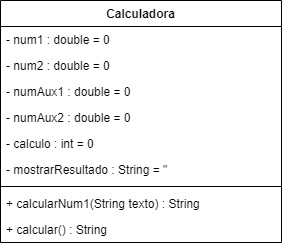

# CalcZilla

> Status : Desenvolvendo e Aperfeiçoando 🚀

+ Somar
+ Subtrair
+ Multiplicar
+ Dividir
+ Potêncializar
+ Radiciação 
+ Emissão dos números calculados
+ Tema: ☀️/🌙

> ### UML 🔮

> ### Ferramentas & Linguagens 💻

Ferramentas   | %
--------- | ------
NetBeans | 60%
Astah | 15%
Flowchart Maker | 15%
GitHub | 10%

> ### Equipe 🌌

Desenvolvedor | Analista de Requisito | Gerente de Projeto
:--------- | :------: | -------:
[GabrielOliveiraSouza21](https://github.com/GabrielOliveiraSouza21) | [HugoDias95](https://github.com/hugodias95) | [PedroAugusto-Sys](https://github.com/PedroAugusto-sys)

